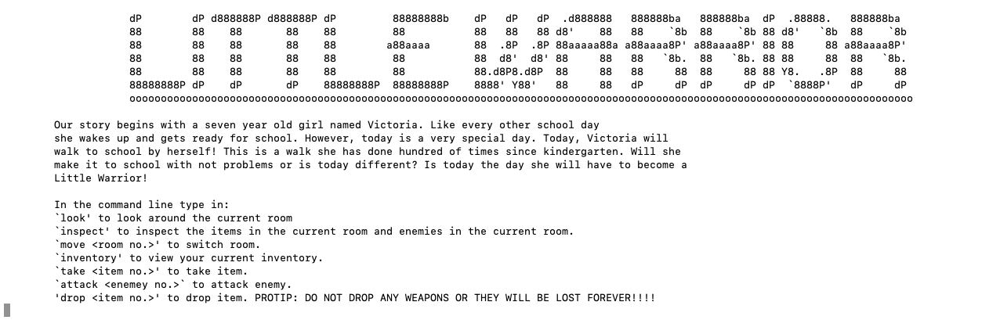

# Game Maker: Danniel Sotelo

# Game Name: Little Warrior

## Project Description
  
  This project for CS410 Rust will be a text based game. The main purpose of this game is for me, the developer, 
  to become more familiar with the Rust Programming Language. The story of the game is based off the many little 
  stories I tell my daughter when I walk her to school. The main character in the story is a seven year old girl. 
  Like every other school day she wakes up to go to school but, this day will be a little different.  
  When starting up the game the player will be presented with a menu of options to perform and a 
  description of their surroundings. The player will then try to go to school.

## Example Image of what my game will look like
  
  Image is taken from my computer while playing a text based game made by Steve Klabnik. My game will have more 
  options and text. This a simple example. https://github.com/steveklabnik/adventure

## License Information

This program is licensed under the "MIT License".  Please
see the file `LICENSE` in the source distribution of this
software for license terms.

